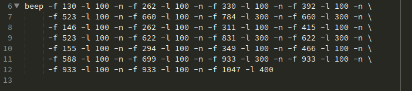
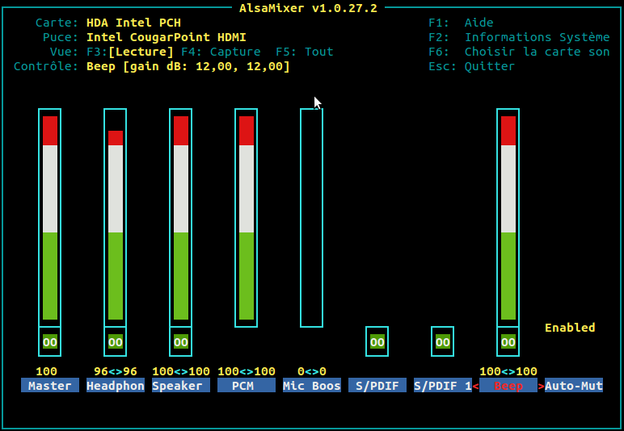

# BEEP THE WORLD
♫ A collection of bash scripts playing various music using beep ♫


## NEEDED :

* UTF-8
* Only one beep command (if possible) : easily killable
* 5 spaces indentation : size of `beep` + space
* New line on `-n` and options space aligned : readable diff
* Punched card style (80 characters line width)




## HOW TO BEEP (Ubuntu / Debian flavour) :

* Load this wonderfull module :
```bash
sudo modprobe pcspkr
```

* Delete permanently this hurtful statements in `/etc/modprobe.d/blacklist.conf` :
```bash
# ugly and loud noise, getting on everyone's nerves; this should be done by a
# nice pulseaudio bing (Ubuntu: #77010)
blacklist pcspkr
```

* You may need to unleash the beast with `M` in alsamixer :




## TODO :

* http://ubuntuforums.org/showthread.php?t=1157670
* http://ubuntuforums.org/showthread.php?t=1157670&page=4
* http://blog.dhampir.no/content/fun-with-beep
* http://kirrus.co.uk/2014/02/linux-beep-music-2/


